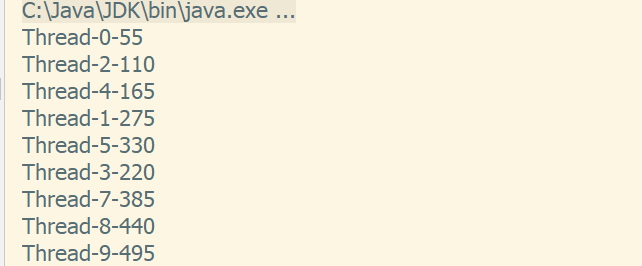
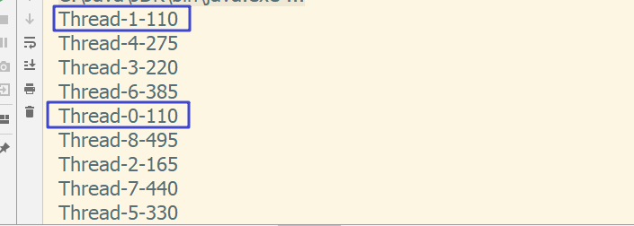
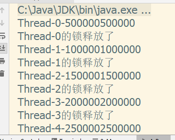

# 多线程研究之线程安全问题
>  主要用户测试并理清楚线程安全与线程不安全在实际使用中的一些问题,以及解决方案。
>
> 创建时间   2019年4月21日   星期天   晴

## 一、重点概括

在我们阅读jdk文档的时候,总会出现某某类是一个线程安全类,比如StringBuffer。某某类是线程不安全的,比如StringBuilder。那到底什么是线程安全,什么是线程不安全呢?

为了节省时间,我们的先放出一些结论

1. 线程安全问题一般是由**全局变量或者静态变量引起的**。若每个线程中对全局变量以及静态变量都只有读取操作,那么这样的公有变量是线程安全的。**若有多个线程同时执行写操作,一般情况下都需要考虑使用线程锁机制,否则就会出现线程安全问题。**
2. 线程安全最大的影响是,在多线程操作时,因为多线程同时读写,带来的对脏数据(就是那个全局的变量或者静态变量)读写,从而影响部分乃至全部的业务逻辑。
3. 想要线程安全,归根结底还是需要加锁,现在的解决方案一般有如下四个
   1. 将全局变量,或静态变量转换为局部变量。性能上来讲,肯定是最好的,毕竟不加锁的多线程才是真正的多线程。
   2. 使用Lock。java提供的一种机制,比synchronized关键字更强大也更灵活,具有更好的性能。
   3. 使用同步代码块,解决线程不安全问题。
   4. 使用同步方法,解决线程不安全问题。
4. 在同样的水平下,线程不安全的类,性能比线程安全的类高。所以不要一味的使用线程安全的类,要视情况而定。比如String类,如果操作少量的字符串拼接直接用这个类本身就行了。如果单线程操作大量字符串拼接使用StringBuilder。如果多线程操作字符串拼接使用StringBuffer。

大概的重点就是上面浅浅的提到的这部分,当然了线程安全是一个非常庞杂高深的内容,这次只是入门级别的介绍。下来就是详细的内容了。

## 二、发现多线程的问题

将git的分支切换到"线程不安全的现象"(是的你没有看错,为了便于理解就是中文分支!)

主要代码如下

```java
package dx.demo;

public class Count {
    private int num;

    public void count() {
        for (int i = 1; i <= 10; i++) {
            num += i;
        }
        System.out.println(Thread.currentThread().getName() + "-" + num);
    }
}  
```


```java
public class MainApplication {
    public static void main(String[] args) {
        Runnable runnable = new Runnable() {
            Count count = new Count();

            public void run() {
                count.count();
            }
        };
        for (int i = 0; i < 10; i++) {
            new Thread(runnable).start();
        }
    }
}
```


执行当前分支的代码会得到如下提示



为什么在控制台会打印如下的数据内容呢?

因为

```java
    for (int i = 0; i < 10; i++) {
        new Thread(runnable).start();
    }
```
相当于将runnable线程的需要执行的方法执行了10次,但是每次执行访问的是同一个count对象,这就导致只有第一次输出是55,符合我们的预期。然后每个线程都会将num进行累加,产生上图打印台的效果。这种情况是我们代码的设计问题,其实并不算线程安全问题。

但是上面的代码多次执行时,偶尔会有重复的num数据出现,这就是发生了**脏读**,这就属于线程安全问题的范畴了。**我们今天要解决的就是多线程产生的脏读问题。**

如果我们将循环次数继续加大,则会有如下情况

```java
public class Count {
    private int num;

    public void count() {
        for (int i = 1; i <= 1000000; i++) {
            num += i;
        }
        System.out.println(Thread.currentThread().getName() + "-" + num);
    }
}  
```


可以看到,num在打印的时候并不是等for循环完毕,另一个线程才进行打印。而是当其他线程在执行`System.out.println(Thread.currentThread().getName() + "-" + num);`的时候会从内存中读取num变量的值,当读取值得时候num在别的线程中还在for循环体内,所以出现数字的位数不像循环很小时呈现的递加55这个情况。**可以得出这样一个结论,当我们需要使用到某个变量的值时,会去内存中进行查找,找到的那一刻,内存中变量的内容是什么就会被读取出来进行使用。**

## 三、解决多线程带来的问题

这里主要是使用Lock、与synchronized关键字,**因为多线程想要进行数据的传递必须使用共享的变量**,所以将全局变量变为局部变量很有可能代码的设计都需要进行改变,这显然在某些情况下是不可取的,所以不多做讨论。

##### 3.1 使用Lock解决线程安全问题

首先在Github中将分支切换到"Lock解决线程安全问题",或者在Git本地版本库中进行切换。

从Java 5之后，在java.util.concurrent.locks包下提供了另外一种方式来实现同步访问，那就是Lock。

首先我们先来说明下,为什么不推荐使用synchronized关键字,线程安全问题只出现在多线程又读又写的过程中,所以在遇到多线程读取的问题时,是不存在线程安全问题的。而如果使用synchronized关键字,会导致线程在读取时依旧不能释放锁对象,导致多线程读取只能同步进行,会对效率进行极大地浪费。而且synchronized关键字释放锁的时机过于保守。

如果使用的是Lock的话,如果出现多线程读取,依旧是**并行**执行,而多线程读写就会同步执行。

具体的代码如下,强烈建议大伙切换分支自己跑一遍,只是看我写的文章还是不够深刻。

main方法没有改变这里就不做展示了。

```java
package dx.demo;

import java.util.concurrent.locks.ReentrantLock;

public class Count {
    private long num;
    ReentrantLock reentrantLock = new ReentrantLock();

    public void count() {
        reentrantLock.lock();
        try {
            for (int i = 1; i <= 1000000; i++) {
                num += i;
            }
            System.out.println(Thread.currentThread().getName() + "-" + num);
        } catch (Exception e) {
            e.printStackTrace();
        } finally {
            System.out.println(Thread.currentThread().getName() + "的锁释放了");
            reentrantLock.unlock();
        }
    }
}  
```

控制台打印结果



可以看出现在,在多线程读写的时候是**有序的**。只有线程0的锁释放后线程1才能拿到锁进行执行。要注意`new ReentrantLock();`必须是所有执行的线程共享的对象,如果是局部对象,那么锁对象就不一致了,依旧会发生脏读。

错误示范大家讲分支切换到"Lock解决线程安全问题错误示范"即可。

